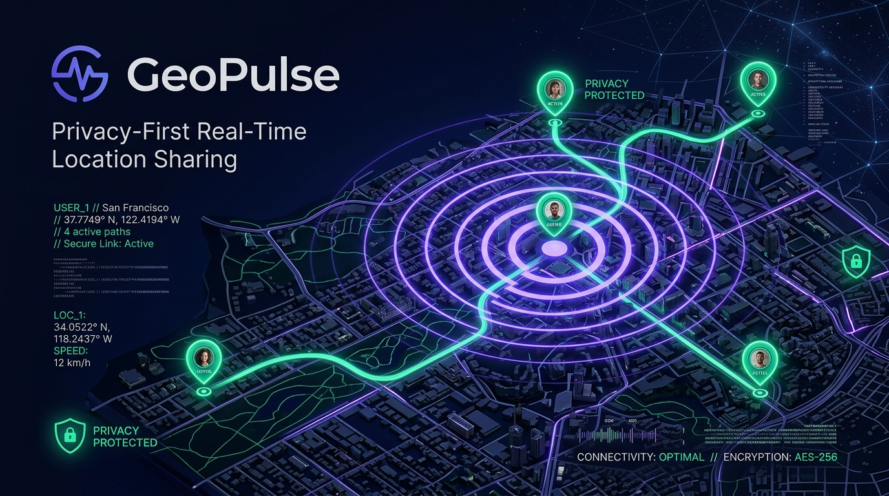
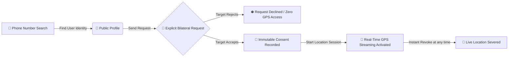
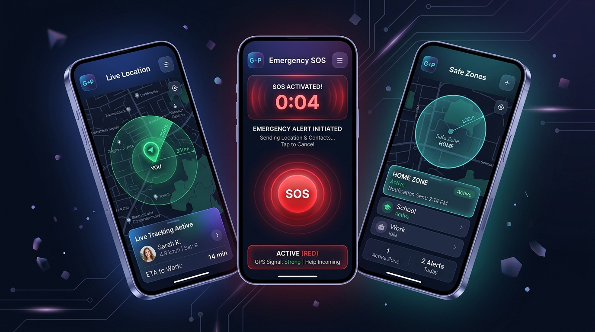
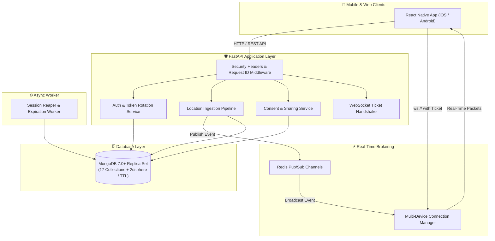

<div align="center">

# 🌐 GeoPulse

### **Privacy-First Real-Time Location Sharing & Safety Platform**

[](https://fastapi.tiangolo.com)
[](https://reactnative.dev)
[](https://www.mongodb.com)
[](https://redis.io)
[](https://www.docker.com)
[](LICENSE)

<br />



<br />

**GeoPulse** is an enterprise-grade, privacy-governed real-time GPS location sharing system engineered for high-concurrency mobile and cloud environments. Built on zero-trust privacy principles, GeoPulse guarantees that **phone numbers alone never expose location without bilateral, cryptographically verifiable user consent**.

[Key Features](#-key-features) • [Architecture](#-architecture) • [Mobile App Showcase](#-mobile-app-showcase) • [Quick Start](#-quick-start) • [Security](#-security-hardening) • [Documentation](#-documentation)

---

</div>

## 🛡️ Core Philosophy: Zero Secret Tracking

> ⚠️ **Strict Privacy Invariant:**
> 
> In GeoPulse, finding or querying a user by phone number returns **strictly public identity data** (name, avatar, online status). GPS coordinates, tracking paths, and movement data are **cryptographically shielded** and are only transmitted when an explicit, bilateral consent record exists in the database.



---

## ✨ Key Features

<div align="center">

</div>

### 🛰️ Real-Time Location Engine
- **8-Stage Ingestion Pipeline**: Coordinates are validated for geospatial bounds, classified for accuracy (`high`, `moderate`, `low`), filtered for impossible velocity (teleportation anomaly detection), and assigned an authoritative server UTC timestamp.
- **Freshness Classification**: Continuous health categorization into `live` ($\le 30\text{s}$), `delayed` ($30\text{s}-120\text{s}$), and `stale` ($>120\text{s}$).
- **Redis Pub/Sub Fanout**: Distributed real-time message brokering guaranteeing sub-50ms latency across thousands of concurrent connected subscribers.

### 📱 Premium React Native Client (`mobile/`)
- **Interactive Dark Map**: Google Maps styled in dark-mode obsidian with glowing accuracy rings and animated beacon pulses.
- **Bilateral Sharing Manager**: Send location requests, accept/decline invites, view active relationships, or terminate tracking in one tap.
- **Safe Zones (Geofencing)**: Draw custom-radius geofences around frequently visited coordinates (Home, Office, School) with automatic arrival/departure notifications.
- **Emergency SOS Broadcast**: 5-second long-press trigger with haptic pulses that instantly alerts all emergency contacts and streams high-frequency telemetry.

### 🔐 Hardened Security Architecture
- **PyMongo Native Async**: Fully modernized with `AsyncMongoClient` (`pymongo>=4.9.0`) across 17 dedicated MongoDB collections.
- **Refresh Token Rotation (§13)**: Hashed token families in MongoDB. Replaying an old token instantly invalidates the entire family to prevent token theft.
- **One-Time WebSocket Tickets (§15)**: Replaced insecure URL-token handshakes with short-lived (30s) single-use tickets.
- **Granular Privacy & Safety**: Mutual blocking (§28), user reporting (§29), and GDPR-compliant complete account purging (§30).

---

## 🏗️ Architecture & System Design



---

## 🗄️ MongoDB Collections Architecture

GeoPulse utilizes **17 specialized collections** optimized for atomicity and high write throughput:

| Collection | Purpose | Key Indexes |
|---|---|---|
| `users` | Core user identity & privacy settings | `phone` (unique), `createdAt` |
| `user_sessions` | Active device sessions & hashed tokens | `tokenHash` (unique), `familyId`, `expiresAt` (TTL) |
| `live_locations` | Current live position per user | `userId` (unique), `location` (2dsphere), `serverTimestamp` |
| `location_history` | Historical movement breadcrumbs | `(userId, serverTimestamp)`, `location` (2dsphere) |
| `location_shares` | Bilateral sharing relationships | `(ownerId, viewerId)`, `status`, `expiresAt` |
| `location_consents` | Immutable audit log of granted permissions | `(ownerId, viewerId)`, `timestamp` |
| `location_sessions` | Active GPS tracking sessions | `sessionId` (unique), `ownerId`, `status` |
| `geofences` | Safe zone definitions & radiuses | `userId`, `center` (2dsphere) |
| `geofence_states` | Persistent geofence occupancy state | `(userId, geofenceId)` (unique) |
| `sos_events` | Emergency alerts & lifecycles | `userId`, `status`, `triggeredAt` |
| `emergency_contacts`| Dedicated emergency contacts per user | `(ownerId, contactUserId)` (unique), `priority` |
| `device_tokens` | Push notification device tokens (FCM/APNs)| `(userId, deviceId)` (unique), `isActive` |
| `blocks` | Dedicated bidirectional block list | `(blockerId, blockedId)` (unique) |
| `reports` | Safety abuse reports | `reporterId`, `reportedUserId`, `status` |
| `audit_logs` | System-wide immutable security audit trail | `actorId`, `action`, `timestamp` |
| `ws_tickets` | One-time 30-second WebSocket handshakes | `ticket` (unique), `expiresAt` (TTL) |
| `notifications` | Real-time user alert records | `userId`, `isRead`, `createdAt` |

---

## 🚀 Quick Start

### Prerequisites
- [Docker](https://www.docker.com/) & [Docker Compose](https://docs.docker.com/compose/)
- [Node.js](https://nodejs.org/) (v18+) & [Python](https://www.python.org/) (v3.12+)

### 1. Clone & Setup Environment
```bash
git clone https://github.com/saktiswarupmishra/Location-Tracking-GeoPulse-.git
cd Location-Tracking-GeoPulse-

# Configure environment variables
cp backend/.env.example backend/.env
```

### 2. Launch Backend Stack (Docker Compose)
```bash
docker-compose up -d --build
```
> 💡 *This starts the **FastAPI API server**, **MongoDB Replica Set** (with automated replica set initialization for multi-collection transactions), and **Redis Pub/Sub** instance.*

Check the health status:
```bash
curl http://localhost:8000/health
```

### 3. Run the Mobile Client (`mobile/`)
```bash
cd mobile
npm install

# Run on Android
npm run android

# Run on iOS
npm run ios
```

---

## 📡 WebSocket Protocol

Connect securely using a single-use handshake ticket:

```bash
# 1. Obtain a one-time WebSocket ticket via REST
POST /api/v1/auth/ws-ticket
Authorization: Bearer <jwt_access_token>

# Response:
{ "ticket": "wst_01J0ABCD1234XYZ..." }

# 2. Connect to WebSocket
ws://localhost:8000/ws/location?ticket=wst_01J0ABCD1234XYZ...
```

### Supported Client Events
- `LOCATION_UPDATE` — Send real-time GPS telemetry `{ latitude, longitude, accuracy, speed, heading, sequence }`
- `LOCATION_START` / `LOCATION_STOP` — Toggle live location sharing broadcast
- `LOCATION_SESSION_PAUSE` / `LOCATION_SESSION_RESUME` — Background tracking control
- `SUBSCRIBE_LOCATION` / `UNSUBSCRIBE_LOCATION` — Focus stream on a specific contact
- `PING` — Keepalive heartbeat (receives `PONG`)

---

## 🧪 Testing & Verification

GeoPulse features a comprehensive async test suite covering unit logic, validation bounds, token security, and concurrency.

```bash
cd backend
pytest -v --cov=app tests/
```

### Key Test Suites:
- `tests/test_security.py` — Verifies Section 58 authorization barriers & token family revocation on reuse.
- `tests/test_location_validation.py` — Verifies coordinate bounds, Null Island rejection, and teleportation detection.
- `tests/test_concurrency.py` — Verifies out-of-order sequence packet dropping & high-throughput validation.
- `tests/test_consent_audit.py` — Verifies immutable consent record creation and audit logs.

---

## 📚 Documentation Directory

Detailed architectural guides and specifications:

- 📖 [Authentication & Token Rotation](docs/authentication.md)
- 🤝 [Location Sharing & Consent Protocol](docs/sharing.md)
- 📍 [Location Processing Pipeline](docs/locations.md)
- ⚡ [WebSocket Real-Time Protocol](docs/websocket.md)
- 🛡️ [Security Hardening & Privacy](docs/security.md)
- 🚢 [Production Deployment Guide](docs/deployment.md)

---

## 📄 License

This project is licensed under the MIT License — see the [LICENSE](LICENSE) file for details.

<div align="center">
  <sub>Built with ❤️ for privacy and safety. Made By Sakti Swarup Mishra.</sub>
</div>
